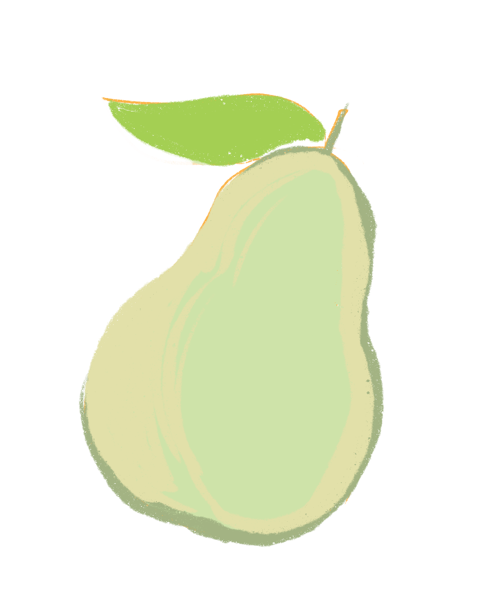

# pear.nvim
Easily switch file pairs for instance c++ and h++. 

<p align="center">
  
</p>


## Install

```lua
return {
    "sylvanfranklin/pear",
    config = function()
        local pear = require("pear")
        vim.keymap.set("n", "<leader>b", function() pear.jump_pairs() end, { silent = true })
    end
}
```
